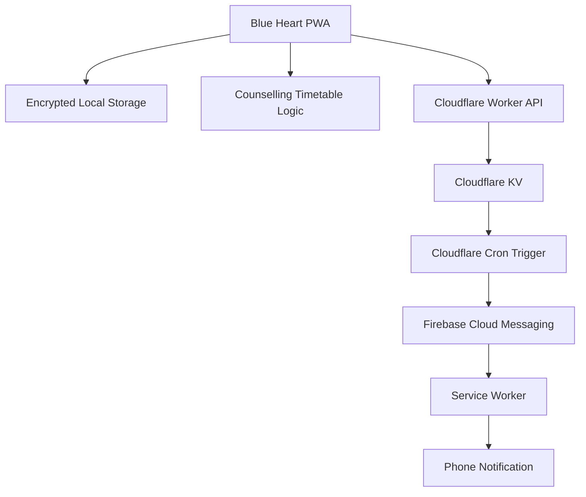
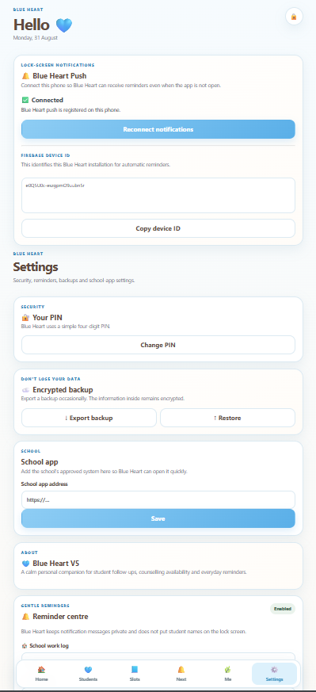
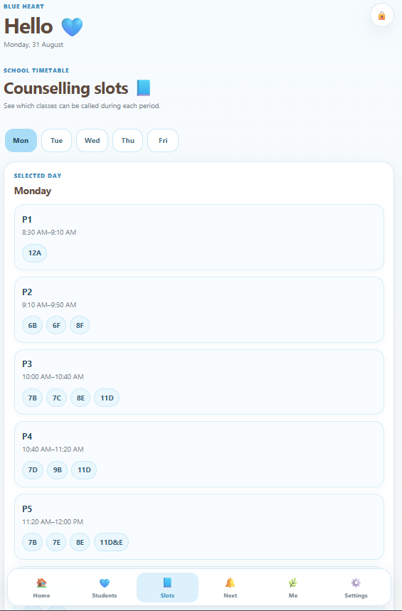

# Blue Heart 🩵

Blue Heart is a privacy-focused, mobile-first Progressive Web App built to help a school counsellor manage student follow-ups, counselling sessions, schedules, reminders, and daily workflow with less friction.

The app is designed for single-user personal use and keeps sensitive student records local to the device.

## ✨ Features

- Student record management
- Session logging
- Follow-up tracking
- Priority-based student workflow
- Quick notes and quick capture
- Counselling availability timetable
- Class-based available counselling slots
- Daily school-app logging reminder
- Vitamin B and Magnesium reminders
- Weekly grocery checklist
- PIN-protected access
- Encrypted local data storage
- Encrypted backup and restore
- Installable Progressive Web App
- Background push notifications
- Follow-up reminders even when the app is closed

## 🔐 Privacy & Security

Blue Heart is designed as a local-first application.

Sensitive counselling records are stored in the browser and encrypted using the Web Crypto API.

The application uses:

- AES-GCM encryption
- PBKDF2-based key derivation
- PIN-protected access
- Local encrypted storage
- Encrypted backup and restore

Full student records are not stored in the notification backend.

Only the minimum reminder information required for scheduled notifications is sent to the serverless reminder service.

## 🔔 Background Reminder System

Blue Heart includes a serverless push-notification system for reliable counselling follow-up reminders.

The notification flow is:

```text
Blue Heart PWA
      ↓
Follow-up scheduled
      ↓
Cloudflare Worker API
      ↓
Cloudflare KV
      ↓
Cron Trigger
      ↓
Firebase Cloud Messaging
      ↓
Service Worker
      ↓
Phone notification
Phone notification
```

This allows reminders to arrive even when the Blue Heart PWA is closed.

## 🏗️ Architecture


## ⚙️ How It Works

1. The counsellor creates and manages student records directly inside the PWA.
2. Sensitive records are encrypted locally in the browser using the Web Crypto API.
3. Follow-ups are scheduled using a date and counselling period.
4. Minimal reminder data is sent to a Cloudflare Worker.
5. Cloudflare KV stores pending reminder jobs.
6. Cron Triggers periodically check for due reminders.
7. Firebase Cloud Messaging delivers the notification to the device.
8. The service worker displays the notification even when the app is closed.
The frontend stores counselling records locally on the device, while the backend only handles the minimal reminder data needed for scheduled push notifications.
This allows reminders to arrive even when the Blue Heart PWA is closed.


## 🧩 Challenges & Engineering Decisions

### Local-First Privacy

Student counselling information can be sensitive, so the application was designed to keep full student records on the user's device rather than storing the complete database on a remote server.

Sensitive application data is encrypted using the Web Crypto API with AES-GCM encryption and PBKDF2-based key derivation.

### Reliable Background Notifications

Browser-based reminders normally depend on the application being open. To make follow-up reminders work when Blue Heart is closed, a serverless notification pipeline was implemented using Cloudflare Workers, Cloudflare KV, Cron Triggers, Firebase Cloud Messaging, and a service worker.

### Minimal Backend Data

The backend does not maintain the complete student database. Only the information required to process a scheduled reminder is sent to the reminder service.

This keeps the main application local-first while still allowing background notifications.

### Timetable-Based Scheduling

School counselling availability depends on both the student's class and the school's period timetable. A timetable-matching layer was added so follow-ups can be associated with appropriate counselling periods instead of relying only on generic clock times.

### PWA Caching and Updates

Service-worker caching introduced challenges during development because older versions of application files could remain cached after deployment. The update strategy was adjusted so new application versions could be delivered without requiring users to clear their local application data.

### Resilient Local Saving

Follow-ups are saved locally before background reminder synchronization is attempted. If the network or reminder backend is unavailable, the counselling record remains saved locally instead of being lost.


🗓️ Counselling Availability

The application includes a school timetable-based counselling availability system.

Students can be matched to counselling periods based on:

Class / division
School day
Available period
Follow-up date
Counselling period timing

This helps reduce manual timetable checking when scheduling student follow-ups.

🛠️ Tech Stack
Frontend
HTML5
CSS3
JavaScript
Progressive Web App
Service Workers
Web Crypto API
Local Storage
Push Notifications
Firebase Cloud Messaging
Firebase Web SDK
Backend
Cloudflare Workers
Cloudflare KV
Cloudflare Cron Triggers
Hosting
GitHub Pages

📁 Project Structure
blue-heart/
├── icon/
│   ├── icon-192.png
│   └── icon-512.png
├── firebase-messaging.js
├── index.html
├── manifest.json
├── script.js
├── service-worker.js
├── style.css
└── timetable.js
📱 Progressive Web App

Blue Heart can be installed on supported mobile devices and used like a standalone application.

The PWA includes:

App manifest
Mobile-friendly interface
Service worker support
Home-screen installation
Background Firebase notifications
🧠 Design Approach

The interface was designed to reduce cognitive load and make frequent counselling tasks faster.

The application focuses on:

Minimal navigation
Quick student access
Clear follow-up priorities
Simple daily workflow
Reduced repetitive data entry
Gentle reminders
Mobile-first interaction
## 📸 Screenshots

### Home
Daily overview with students requiring attention, reminders, and quick actions.



### Student Management
Search and manage student records, priorities, and counselling information.


### Counselling Availability
Timetable-based availability helps identify suitable counselling periods for each class.



### Follow-ups
Upcoming counselling follow-ups organised by date and priority.


🚀 Live Demo


🌐 **[Open Blue Heart](https://sathyapriyapr.github.io/blue-heart/)**

Blue Heart is deployed as an installable Progressive Web App using GitHub Pages.

> **Demo note:** The application starts with an empty local database. No real student records are included in this repository or deployment.

The public repository does not contain real student records, private API keys, Firebase service-account credentials, or other sensitive user data.

⚠️ Privacy Note

Blue Heart is a personal workflow tool and is not intended to function as a hospital Electronic Health Record or clinical records platform.

Sensitive student information should only be handled according to the policies and privacy requirements of the relevant institution.

👩‍💻 Developer

Developed as a practical full-stack/serverless project demonstrating:

JavaScript application development
PWA architecture
Client-side encryption
Cloud/serverless integration
Push notification systems
Scheduled background processing
Real-world workflow design
